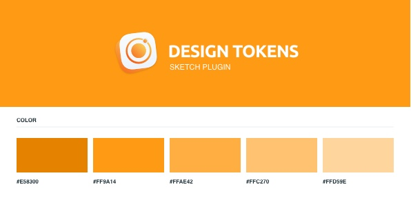
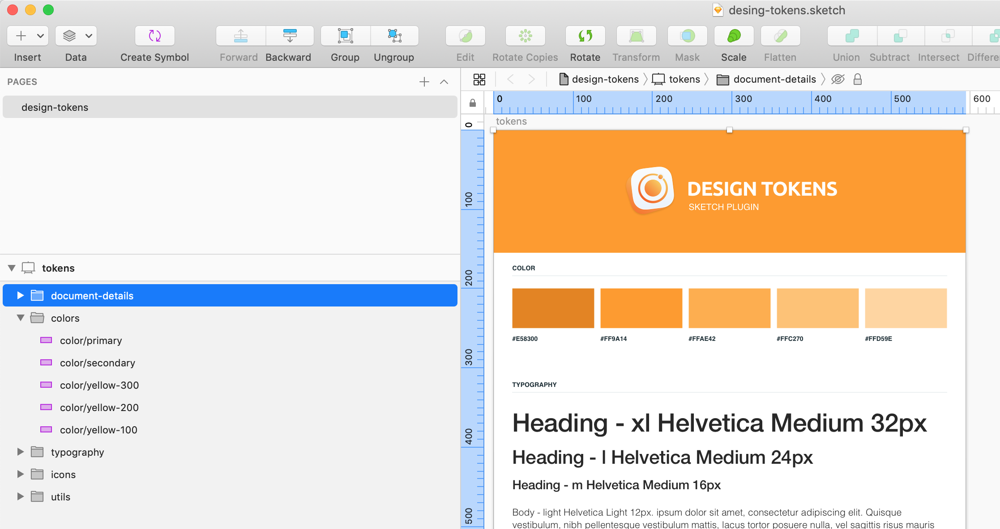
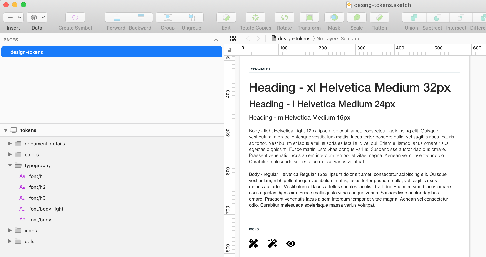
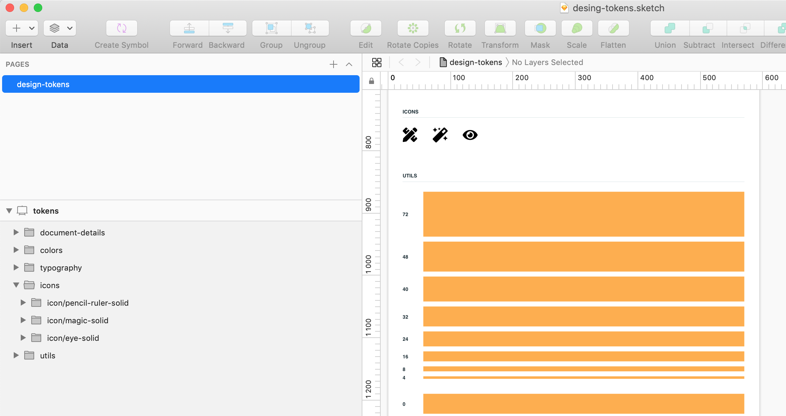
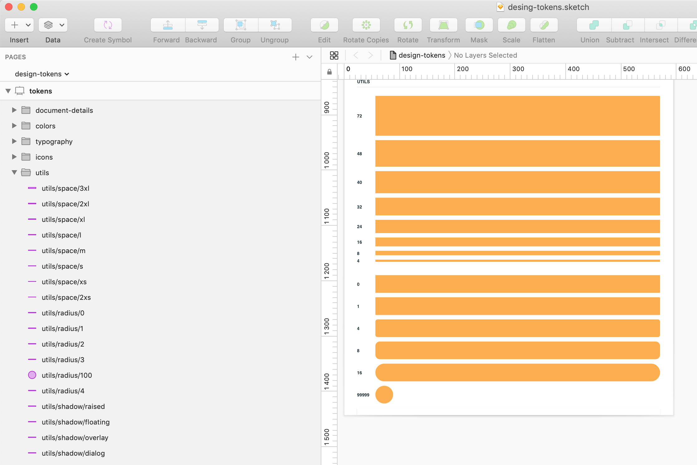

# Design Tokens

Delivering consistent Desing System. A Sketch plugin that exports Desing Tokens to JSON format. You can export colors, typography, icons and utilis.
A must-have tool for design system project.


## Features 

1. Desingn tokens in single source of truth file as Sketch library
2. Color tokens as JSON object
3. Typography tokens as JSON object
4. Icon tokens as JSON object
5. Utils tokens as JSON object

### 1. Desingn tokens in single source of truth file as Sketch library

Use example `desing-tokens.sketch` file in `example-file` folder. You can fill in the content you want
in the example file. Make sure that you use layer style and text styles when you create tokens. 
All tokens must be at the subfolder in Sketch named by color, typography, icons and utils.


### 2. Color tokens as JSON object 

To define color tokens must be inside group call colors and layer named by color/{name}. Importan also to make layer to Layer Style.
To create a Layer Style, select a layer, and choose  `Layer › Create new Layer Style` [ Learn here ](https://www.sketch.com/docs/styling/shared-styles/)



**Sketch naming - colors/color/name**  
**JSON output - color/index.json**

```json
{
    "color": {
        "name": {
            "value": "#ffd59e",
            "type": "color"
        }
    }
}
```

### 3. Typography tokens as JSON object

To define text tokens must be inside group call typography and layer named by font/{name}. Importan also to make layer to Text Style.
To create a Layer Style, select a layer, and choose  `Layer › Create new Text Style ` [ Learn here ](https://www.sketch.com/docs/text/text-styles/)



**Sketch naming - typography/font/name**  
**JSON output - typography/index.json**

```json
{
    "typography": {
        "name": {
            "font-family": {
                "value": "Helvetica"
            },
            "font-size": {
                "value": 12
            },
            "weight": {},
            "letter-spacing": {
                "value": 0
            },
            "line-height": {
                "value": 16
            },
            "type": "typography"
        }
    }
}
```

### 4. Icon tokens as JSON object

To define icons tokens must be inside group call icons and layer named by icon/{name}. Important to keep the SVG icon to union format.



**Sketch naming - icons/icon/name**  
**JSON output - icons/index.json**

```json
{
    "icon": {
        "icon-eye-solid": {
            "value": "<svg id='icon-eye-solid' width='24px' height='16px' viewBox='0 0 24 16' version='1.1' xmlns='http://www.w3.org/2000/svg' xmlns:xlink='http://www.w3.org/1999/xlink'>    <!-- Generator: Sketch 59.1 (86144) - https://sketch.com -->    <title>Shape</title>        <g id='design-tokens' stroke='none' stroke-width='1' fill='none' fill-rule='evenodd'>        <g id='tokens' transform='translate(-120.000000, -767.000000)' fill='#000000' fill-rule='nonzero'>            <g id='icons' transform='translate(24.000000, 763.000000)'>                <g id='icon/eye-solid' transform='translate(96.000000, 4.000000)'>                    <path d='M23.8549772,7.39166667 C21.5953939,2.98291667 17.1220605,0 11.9999772,0 C6.87789388,0 2.40331055,2.985 0.144977215,7.39208333 C-0.0483257383,7.77445825 -0.0483257383,8.22595841 0.144977215,8.60833333 C2.40456055,13.0170833 6.87789388,16 11.9999772,16 C17.1220605,16 21.5966439,13.015 23.8549772,8.60791667 C24.0482802,8.22554175 24.0482802,7.77404159 23.8549772,7.39166667 Z M11.9999772,14 C8.68626872,14 5.99997721,11.3137085 5.99997721,8 C5.99997721,4.6862915 8.68626872,2 11.9999772,2 C15.3136857,2 17.9999772,4.6862915 17.9999772,8 C18.0007514,9.59153616 17.368859,11.1181095 16.2434729,12.2434957 C15.1180867,13.3688818 13.5915134,14.0007742 11.9999772,14 L11.9999772,14 Z M11.9999772,3.99998885 C11.6429486,4.00498962 11.2882238,4.05810724 10.9453939,4.15791667 C11.529363,4.95150825 11.4460613,6.05266558 10.749352,6.74937482 C10.0526428,7.44608405 8.95148546,7.52938577 8.15789388,6.94541667 C7.70949625,8.59740065 8.36454792,10.3513572 9.78606474,11.3049826 C11.2075816,12.2586081 13.0789344,12.1994915 14.4374264,11.1580449 C15.7959183,10.1165982 16.3389584,8.3247936 15.7871857,6.70440527 C15.2354129,5.08401694 13.7117293,3.9959707 11.9999772,3.99998885 L11.9999772,3.99998885 Z' id='Shape'></path>                </g>            </g>        </g>    </g></svg>",
            "type": "icon"
        },
    }
}
```

### 5. Utils tokens as JSON object

To define text tokens must be inside group call utils. There is different naming convation for other tokens.
Utils has multiple token types. Types are space, radius and shadow. See how to name layer from below list.



**Sketch naming - utils/space/name**  
**Sketch naming - utils/radius/name** 
**Sketch naming - utils/shadow/name**   
**JSON output - utils/index.json**

```json
{
    "utils": {
        "space-name": {
            "spacer": 4,
            "type": "utils"
        },
        "radius-name": {
            "radius": [
                16,
                16,
                16,
                16
            ],
            "type": "utils"
        },
        "shadow-name": {
            "shadows": [
                [
                    {
                        "blur": 24,
                        "x": 0,
                        "y": 8,
                        "spread": 0,
                        "color": "#473f4f29",
                        "enabled": true
                    },
                    {
                        "blur": 16,
                        "x": 0,
                        "y": 4,
                        "spread": 0,
                        "color": "#2e293314",
                        "enabled": true
                    }
                ]
            ],
            "type": "utils"
        }
    }
}
```

## How to install 

- Download the [Zip-folder](). Extract zip and double-click the `design-tokens.sketchplugin`

## Roadmap

- To-Do


## Contact/Feedback

Mail [andreas.koutsoukos@gmai.com](mailto:andreas.koutsoukos@gmail.com)

## License

This project is licensed under the terms of the MIT license.